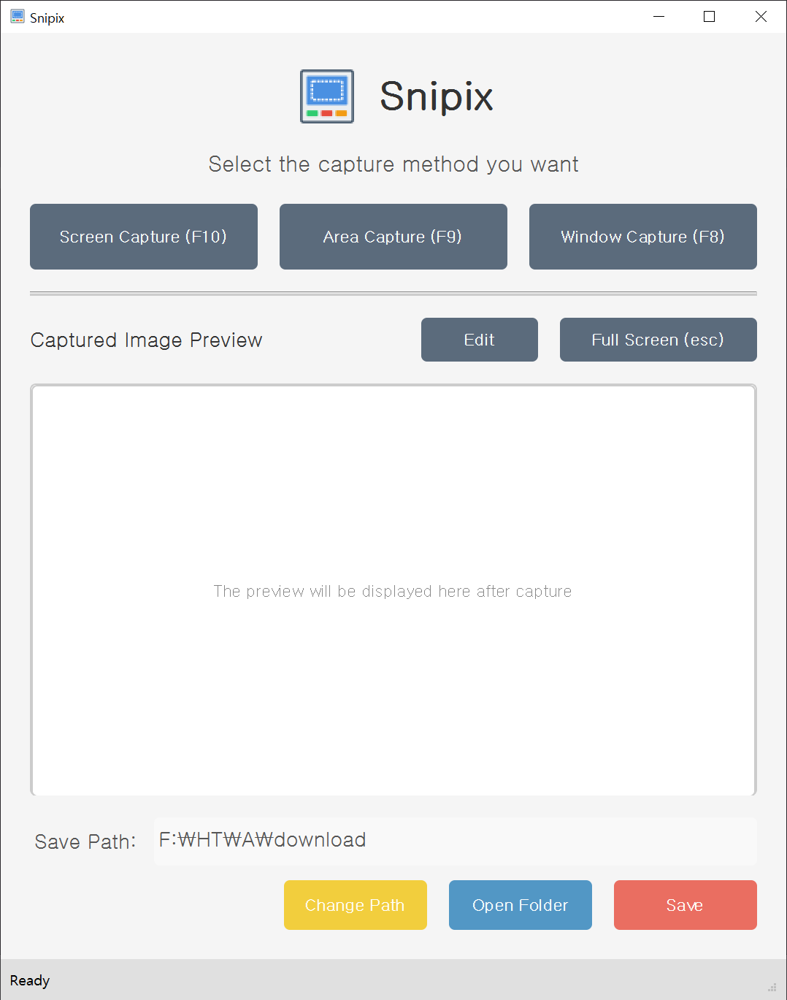

# Snipix 📸

Snipix is a powerful screen capture tool that allows you to take high-quality screenshots of your screen, selected areas, or specific windows with just a few clicks. ✨

## Links 🔗

- [Download 💾](https://github.com/htpaak/Snipix/releases/latest)
- [GitHub Repository 💻](https://github.com/htpaak/Snipix)
- [Feedback 💬](https://github.com/htpaak/Snipix/discussions)

## Features ✨

- **Full Screen Capture** 🖥️: Capture your entire screen with a single hotkey (F10)
- **Rectangular Area Capture** 🖱️: Select and capture a specific area of your screen (F9)
- **Window Capture** 🖼️: Capture a specific application window with automatic detection (F8)
- **High-Quality Images** 💎: All captures are saved in high-quality PNG format
- **Preview Functionality** 👀: Preview your captures before saving
- **Intuitive User Interface** 👌: Clean and easy-to-use interface for all users

## Demo 📸

## System Requirements 💻

- Windows 7/8/10/11 ✅
- 50MB of free disk space ✅
- No special hardware requirements ✅

## Installation 🚀

1. Download the latest release from the [releases page](https://github.com/htpaak/Snipix/releases/latest) 🔽
2. Run the installer or extract the portable version 📦
3. Launch Snipix and start capturing! 🎉

## Usage 🖱️

1. Launch Snipix ▶️
2. Select your preferred capture method:
   - Full Screen Capture (F10) ⌨️
   - Rectangular Area Capture (F9) ⌨️
   - Window Capture (F8) ⌨️
3. After capturing, preview your screenshot 🖼️
4. Click "Save" to save the image to your chosen location 💾

## Development 🛠️

Built with:
- Python 3.9 🐍
- PyQt5 for the user interface 🎨
- MSS for screen capture functionality 📷
- Pillow for image processing 🖼️

## License 📄

This project is licensed under the MIT License - see the LICENSE file for details.

## Acknowledgments 🙏

- Thanks to all the contributors who have helped with development 🙌
- Special thanks to the open-source libraries that made this project possible ❤️
